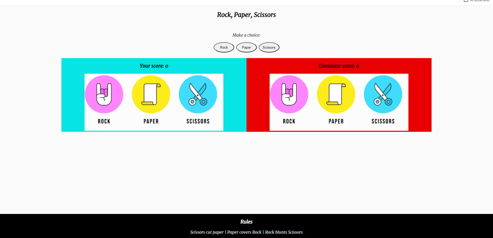

Welcome,

# Rock Paper Scissors Game

This is a simple Rock Paper Scissors game implemented using HTML, CSS, and JavaScript.

## Overview

This game allows users to play Rock Paper Scissors against the computer. The user selects their choice by clicking one of the buttons, and the computer randomly selects its choice. The winner is determined based on the classic Rock Paper Scissors rules.

## Features

- Player can select between Rock, Paper, and Scissors.
- Computer randomly selects its choice.
- Winner is determined based on classic Rock Paper Scissors rules.
- Scores are updated dynamically on the screen.
- Provides feedback messages to the user indicating the winner or if it's a draw.

## Technologies Used

- HTML
- CSS
- JavaScript

## How to Play

1. Open the `index.html` file in your web browser.
2. Click on one of the buttons to make your choice (Rock, Paper, or Scissors).
3. The computer will randomly select its choice.
4. The winner will be displayed on the screen, along with updated scores.

## Folder Structure

- `index.html`: Main HTML file containing the structure of the game.
- `assets/`: Folder containing subfolders for images, stylesheets, and JavaScript files.
  - `images/`: Contains images used in the game.
  - `css/`: Contains the CSS file (`style.css`) for styling the game.
  - `javascript/`: Contains the JavaScript file (`index.js`) for game logic.

## Preview

## Credits

This project is created by Ahmed Hamad. Feel free to contribute or report issues if any.

